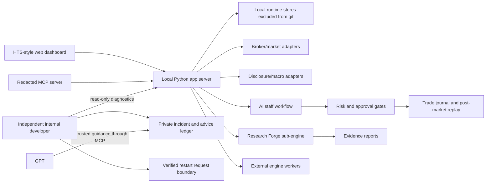

# CodexStock

CodexStock is a local-first AI investment research, validation, and trading-operations platform.

It combines market monitoring, candidate discovery, strategy research, paper/live separation, AI staff reviews, MCP access, post-market replay, and safety-first trade reconciliation into one personal workstation.

Created and maintained by **Jinwoo Kim** (`burunchhehe`).

> This repository is a public evaluation build. It contains source code and non-confidential documentation only. It does not contain API keys, account numbers, live order logs, private journals, runtime databases, or personal trading records.

## Why It Exists

Most personal trading projects stop at one of these layers:

- a screener
- a backtester
- a broker API wrapper
- a dashboard
- an LLM chat helper

CodexStock is built as an operating loop instead:

```text
market data -> candidates -> AI staff review -> risk gate -> paper/live plan
            -> order/fill/account reconciliation -> journal -> post-market replay
            -> strategy improvement -> next session
```

The goal is not to claim guaranteed returns. The goal is to make the research, decision, execution, review, and improvement process auditable.

## 2026-07-19 Verified Upgrade

The current upgrade adds a bounded internal-developer and recovery loop. It is deliberately separate from the trading decision path: it can observe, diagnose, report, and run a small allowlist of operational recoveries, but it cannot place orders, edit source code, change credentials, relax risk limits, or disable security controls.

```text
heartbeat and read-only diagnostics
    -> incident classification
    -> safe allowlisted recovery or report-only escalation
    -> Telegram and launcher status
    -> GPT reads the report through MCP
    -> external advice is stored as untrusted guidance
    -> local policy validates structured actions
    -> bounded handler runs and is reverified
    -> recovery evidence and history are preserved
```

New capabilities in this upgrade:

- independent one-minute internal-developer sidecar with single-instance protection
- busy/progress-aware watchdog logic that does not restart healthy long-running work
- atomic incident, report, advice, event, and verified-playbook ledgers
- nine read-only/internal-developer MCP operations for status, incidents, reports, diagnostics, and external guidance intake
- Telegram incident reporting through the existing reporting queue rather than a second bot receiver
- draggable launcher health dock with healthy, attention, incident, and recovered states
- direct operational-status replies that bypass the local LLM when a deterministic answer is available
- local-only Ollama startup recovery with a CPU fallback for an incompatible GPU runtime

Verification performed on 2026-07-19:

- Python compile checks passed for the app, MCP server, and internal-developer modules
- JavaScript syntax check passed for the launcher UI
- 79 focused internal-developer, policy, scheduler, MCP, storage, and end-to-end tests passed
- a synthetic incident completed the Telegram -> GPT/MCP advice -> policy check -> local revalidation loop
- dangerous or malformed advice was quarantined; no order, code, credential, security, or risk-policy mutation was executed
- the live read-only launcher endpoint reported a fresh heartbeat, zero real open incidents, and `RECOVERED` status at verification time
- an Ollama stop/start drill recovered the local service and returned a model response; the operator model configuration was restored afterward

See [docs/VERIFIED_UPGRADE_2026-07-19.md](docs/VERIFIED_UPGRADE_2026-07-19.md) and [docs/INTERNAL_DEVELOPER.md](docs/INTERNAL_DEVELOPER.md) for the evidence and safety boundaries.

## What Was Built And Why

CodexStock was built around one question: how can a personal investor turn scattered market data, AI opinions, strategy tests, order decisions, and daily reviews into one repeatable operating system?

| Purpose | Implemented Feature | Why It Matters |
| --- | --- | --- |
| Avoid random stock picking | Market radar, watchlists, movers, sector/theme checks, and external signal intake | Candidates should come from observable market strength, liquidity, news, and repeatable filters instead of memory or impulse |
| Make AI decisions inspectable | AI staff roles for research, supply/demand, fundamentals, strategy, trading, risk, and reporting | Each candidate can be reviewed from multiple angles before it reaches a trading plan |
| Stop one model from overruling risk | Risk manager, approval gates, concentration checks, delegated-limit controls, and live/paper separation | The system can generate ideas aggressively while keeping execution behind explicit safety rules |
| Separate research from execution | Research Forge, backtest workers, replay jobs, and paper/live state boundaries | Heavy experiments can run without interfering with intraday monitoring or live-trading safety |
| Learn from every session | Post-market replay, missed-name review, trade journal, learning traces, and next-cycle improvement notes | The system records why a stock was selected, rejected, bought, sold, or missed so the next session can improve |
| Verify instead of trusting outputs | Walk-forward validation, replay evidence, reconciliation checks, and test reports | Strategy results and operational claims need evidence, not just summaries |
| Keep GPT access useful but safe | Redacted MCP tools for health, candidates, reports, staff summaries, learning state, and external signals | GPT can inspect and explain the system without receiving private account data or credentials |
| Detect and recover from operational faults | Independent internal developer, heartbeat/progress classifier, allowlisted handlers, incident ledger, and launcher health dock | Routine faults can be diagnosed and safely recovered while dangerous changes remain report-only |
| Use external technical advice safely | GPT/MCP report reader, untrusted advice store, strict action schema, quarantine, and post-action verification | Higher-level advice can be reviewed and applied only through pre-registered local handlers |
| Protect private runtime data | Source/runtime separation, `.env.example`, excluded databases, and credential-free public build | The public repository can be reviewed without exposing personal trading records, keys, or account information |

## Core Capabilities

| Area | What CodexStock Provides |
| --- | --- |
| Market radar | Intraday radar, watchlist context, sector/theme checks, external signal inbox |
| Candidate discovery | Screeners, momentum/liquidity filters, candidate scoring, AI decision context |
| AI staff workflow | Research, supply/demand, fundamentals, strategy, trading, risk, and reporting roles |
| Research Forge | Reproducible research engine for walk-forward validation, replay, reports, and evidence bundles |
| Sub-engine orchestration | Research Forge, external signal scout, KIS gateway, and optional quant/backtest workers |
| Backtest/replay | Historical training, daily replay, missed-name review, replay evidence, learning traces |
| Trading operations | Paper/live separation, delegated limits, order intent logs, reconciliation-oriented state machine |
| GPT/MCP access | Redacted local MCP tools for status, candidates, reports, and learning summaries |
| Internal developer | Independent diagnostics, incident reports, safe recovery allowlist, GPT advice bridge, recovery verification |
| Operational visibility | One-minute heartbeat, Telegram alerts, launcher health dock, incident/advice/report history |
| Safety | Read-only defaults, explicit live-trading gates, credential exclusion, runtime/source separation |

See [docs/FEATURES.md](docs/FEATURES.md) for a fuller feature map.
See [docs/SUB_ENGINES.md](docs/SUB_ENGINES.md) for the sub-engine strategy.
See [playmcp-public-version/](playmcp-public-version/) for the PlayMCP-ready public read-only MCP preview.

## Actual UI Screenshots

These are selected real CodexStock UI captures. They were included because they do not show account numbers, balances, tokens, private journals, live positions, or real order/fill logs.


## Architecture



See [docs/ARCHITECTURE.md](docs/ARCHITECTURE.md) for details.

## Safety Boundaries

CodexStock separates source code from private runtime state.

This repository intentionally excludes:

- `.env`, `.env.local`, and all real credentials
- broker API keys, tokens, account numbers, approval phrases, and chat IDs
- live account snapshots, order logs, fill logs, reconciliation logs, and PnL logs
- private trading journals, Telegram logs, staff long-memory files, and watchlists
- generated databases, archives, reports, builds, and third-party source vaults

Live trading is disabled by default and must only be enabled in a private local runtime with user-owned credentials and explicit safety gates.

The internal developer is not an unrestricted coding agent. Its automatic action set is intentionally limited to registered cache refreshes, registered external-engine reconnects, one bounded retry of eligible research work, internal ledger rebuilds, read-only database-lock detection, restart requests for the independent watchdog, and report writing. Everything else is quarantined or escalated.

## Repository Layout

| Path | Purpose |
| --- | --- |
| `app/` | Local app server, integrations, MCP bridge, operational logic |
| `app/internal_developer_*.py` | Independent storage, policy engine, and read-only recovery sidecar |
| `app/web/` | Browser dashboard UI |
| `packages/stock_suite/` | Reusable stock-suite package facade |
| `packages/codexstock_research_forge/` | Research-only validation engine |
| `tools/` | Local verification, gateway, and worker scripts |
| `tools/run_internal_developer.ps1` | One safe internal-developer cycle for local diagnostics |
| `tests/` | Regression tests for safety, MCP contracts, replay, research, and reconciliation |
| `docs/` | Public documentation and evaluation notes |
| `.env.example` | Empty configuration template |

## Quick Start

```powershell
python -m venv .venv
.\.venv\Scripts\Activate.ps1
python -m pip install -e .
python -m stock_suite status
```

Run the local app:

```powershell
Copy-Item .env.example .env.local
.\run_app.ps1
```

Fill `.env.local` only with your own credentials. Never commit it.

## Validation

```powershell
python -m py_compile app\stock_suite_app.py app\codexstock_mcp_server.py
node --check app\web\app.js
python -m pytest tests
```

Focused internal-developer verification:

```powershell
python -m unittest `
  tests.test_internal_developer_store `
  tests.test_internal_developer_engine `
  tests.test_internal_developer_service `
  tests.test_internal_developer_end_to_end `
  tests.test_mcp_internal_developer_bridge `
  tests.test_internal_developer_scheduler_contract
```

The full test suite may require optional local dependencies and configured mock providers. Syntax checks should work on a basic clone.

## Public MCP Strategy

The internal system has a broad tool surface, but a public MCP should be compact, read-only, and easy for an LLM to choose correctly.

Recommended public surface: 18-20 read-only tools covering market brief, candidate review, strategy validation, paper replay, risk scenario, post-market review, learning report, staff summary, external signal summary, and health.

Live order submission, account mutation, and exact private-account details should not be exposed.

See [docs/PUBLIC_MCP_SURFACE.md](docs/PUBLIC_MCP_SURFACE.md).

## Current Status

CodexStock is an active personal research platform, not a certified financial product.

Strong areas:

- large integrated local workflow
- strong safety separation concept
- AI staff/review loop
- Research Forge integration
- MCP-ready redacted status surface
- post-market review and learning evidence direction
- bounded self-diagnostics and safe recovery sidecar
- Telegram, launcher, and GPT/MCP incident visibility
- verified external-advice intake with strict quarantine and revalidation

Still needs long-horizon proof:

- forward paper/live observation over time
- stricter point-in-time market universe evidence
- verified corporate-action histories
- broader out-of-sample and stress validation
- production-grade packaging and onboarding

See [docs/ROADMAP.md](docs/ROADMAP.md).

## Disclaimer

CodexStock is research software. It is not investment advice, a broker, a fiduciary, or a profit guarantee.

Backtests, paper results, AI-generated explanations, and strategy reports can be wrong, overfit, delayed, incomplete, or unsuitable for real capital. Use at your own risk.
