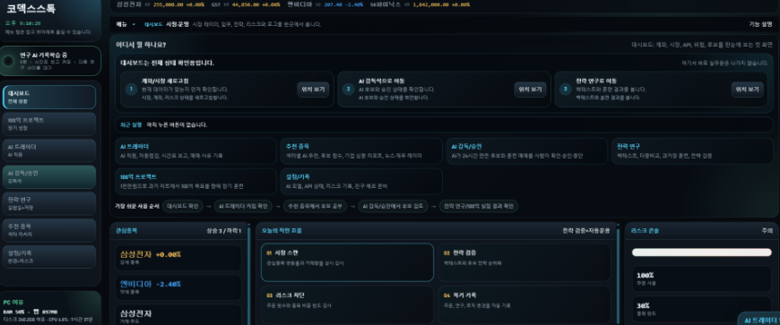
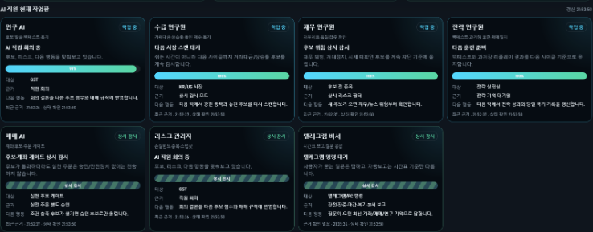
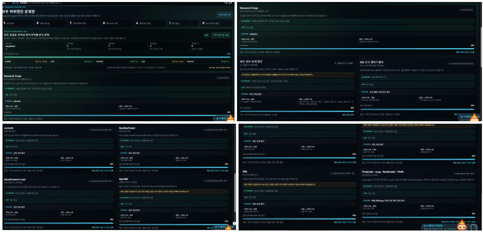
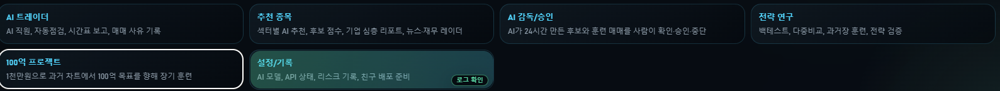
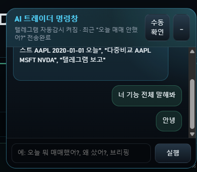
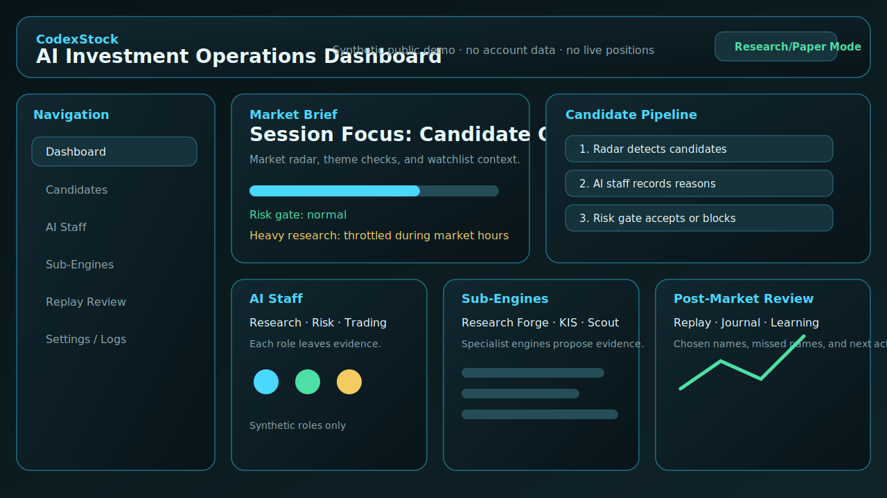
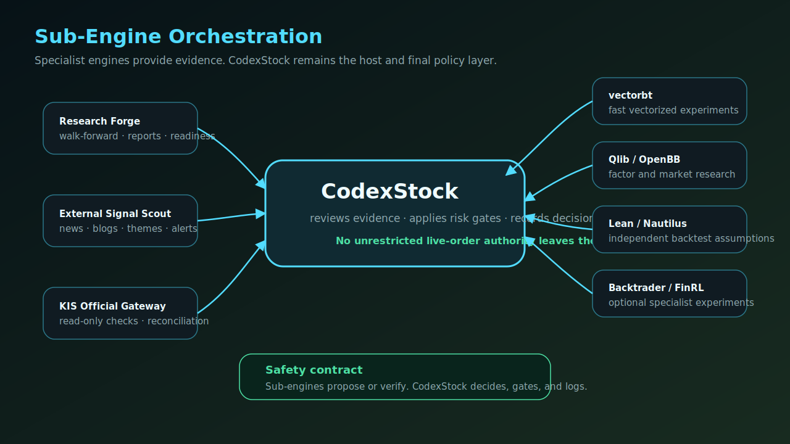
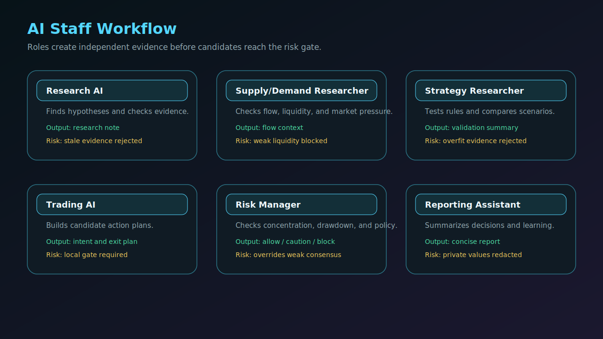
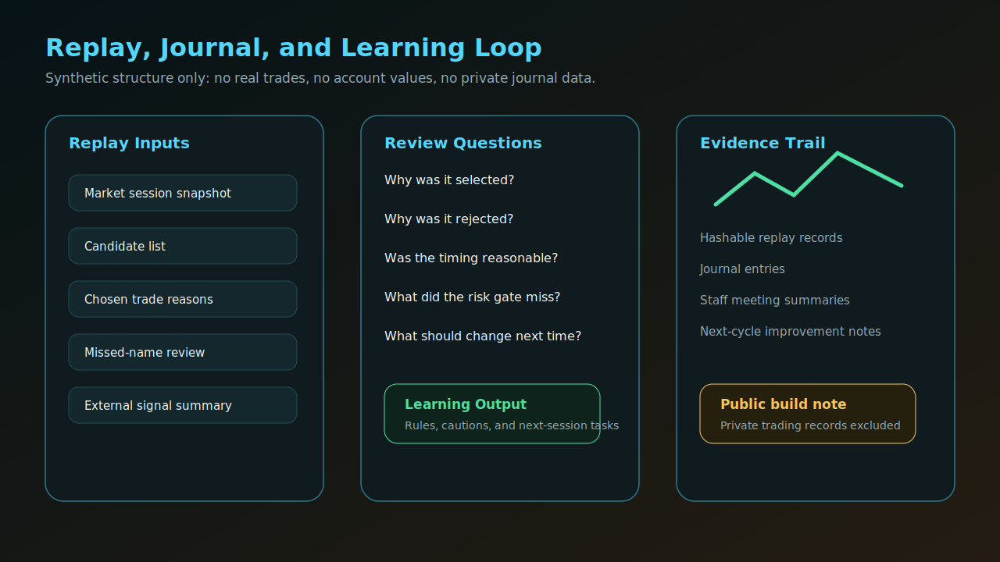
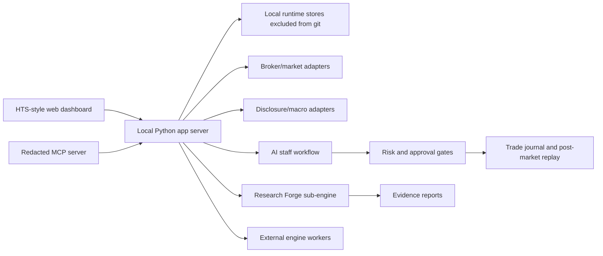

# CodexStock

CodexStock is a local-first AI investment research, validation, and trading-operations platform.

It combines market monitoring, candidate discovery, strategy research, paper/live separation, AI staff reviews, MCP access, post-market replay, and safety-first trade reconciliation into one personal workstation.

Created and maintained by **Jinwoo Kim** (`burunchhehe`).

> This repository is a public evaluation build. It contains source code and non-confidential documentation only. It does not contain API keys, account numbers, live order logs, private journals, runtime databases, or personal trading records.

## Why It Exists

Most personal trading projects stop at one of these layers:

- a screener
- a backtester
- a broker API wrapper
- a dashboard
- an LLM chat helper

CodexStock is built as an operating loop instead:

```text
market data -> candidates -> AI staff review -> risk gate -> paper/live plan
            -> order/fill/account reconciliation -> journal -> post-market replay
            -> strategy improvement -> next session
```

The goal is not to claim guaranteed returns. The goal is to make the research, decision, execution, review, and improvement process auditable.

## Core Capabilities

| Area | What CodexStock Provides |
| --- | --- |
| Market radar | Intraday radar, watchlist context, sector/theme checks, external signal inbox |
| Candidate discovery | Screeners, momentum/liquidity filters, candidate scoring, AI decision context |
| AI staff workflow | Research, supply/demand, fundamentals, strategy, trading, risk, and reporting roles |
| Research Forge | Reproducible research engine for walk-forward validation, replay, reports, and evidence bundles |
| Sub-engine orchestration | Research Forge, external signal scout, KIS gateway, and optional quant/backtest workers |
| Backtest/replay | Historical training, daily replay, missed-name review, replay evidence, learning traces |
| Trading operations | Paper/live separation, delegated limits, order intent logs, reconciliation-oriented state machine |
| GPT/MCP access | Redacted local MCP tools for status, candidates, reports, and learning summaries |
| Safety | Read-only defaults, explicit live-trading gates, credential exclusion, runtime/source separation |

See [docs/FEATURES.md](docs/FEATURES.md) for a fuller feature map.
See [docs/SUB_ENGINES.md](docs/SUB_ENGINES.md) for the sub-engine strategy.

## Actual UI Screenshots

These are selected real CodexStock UI captures. They were included because they do not show account numbers, balances, tokens, private journals, live positions, or real order/fill logs.












## Public Structure Diagrams

These are synthetic structure-only demo images. They do not show real accounts, real positions, real order history, private journals, or personal runtime data.









## Architecture



See [docs/ARCHITECTURE.md](docs/ARCHITECTURE.md) for details.

## Safety Boundaries

CodexStock separates source code from private runtime state.

This repository intentionally excludes:

- `.env`, `.env.local`, and all real credentials
- broker API keys, tokens, account numbers, approval phrases, and chat IDs
- live account snapshots, order logs, fill logs, reconciliation logs, and PnL logs
- private trading journals, Telegram logs, staff long-memory files, and watchlists
- generated databases, archives, reports, builds, and third-party source vaults

Live trading is disabled by default and must only be enabled in a private local runtime with user-owned credentials and explicit safety gates.

## Repository Layout

| Path | Purpose |
| --- | --- |
| `app/` | Local app server, integrations, MCP bridge, operational logic |
| `app/web/` | Browser dashboard UI |
| `packages/stock_suite/` | Reusable stock-suite package facade |
| `packages/codexstock_research_forge/` | Research-only validation engine |
| `tools/` | Local verification, gateway, and worker scripts |
| `tests/` | Regression tests for safety, MCP contracts, replay, research, and reconciliation |
| `docs/` | Public documentation and evaluation notes |
| `.env.example` | Empty configuration template |

## Quick Start

```powershell
python -m venv .venv
.\.venv\Scripts\Activate.ps1
python -m pip install -e .
python -m stock_suite status
```

Run the local app:

```powershell
Copy-Item .env.example .env.local
.\run_app.ps1
```

Fill `.env.local` only with your own credentials. Never commit it.

## Validation

```powershell
python -m py_compile app\stock_suite_app.py app\codexstock_mcp_server.py
node --check app\web\app.js
python -m pytest tests
```

The full test suite may require optional local dependencies and configured mock providers. Syntax checks should work on a basic clone.

## Public MCP Strategy

The internal system has a broad tool surface, but a public MCP should be compact, read-only, and easy for an LLM to choose correctly.

Recommended public surface: 18-20 read-only tools covering market brief, candidate review, strategy validation, paper replay, risk scenario, post-market review, learning report, staff summary, external signal summary, and health.

Live order submission, account mutation, and exact private-account details should not be exposed.

See [docs/PUBLIC_MCP_SURFACE.md](docs/PUBLIC_MCP_SURFACE.md).

## Current Status

CodexStock is an active personal research platform, not a certified financial product.

Strong areas:

- large integrated local workflow
- strong safety separation concept
- AI staff/review loop
- Research Forge integration
- MCP-ready redacted status surface
- post-market review and learning evidence direction

Still needs long-horizon proof:

- forward paper/live observation over time
- stricter point-in-time market universe evidence
- verified corporate-action histories
- broader out-of-sample and stress validation
- production-grade packaging and onboarding

See [docs/ROADMAP.md](docs/ROADMAP.md).

## Disclaimer

CodexStock is research software. It is not investment advice, a broker, a fiduciary, or a profit guarantee.

Backtests, paper results, AI-generated explanations, and strategy reports can be wrong, overfit, delayed, incomplete, or unsuitable for real capital. Use at your own risk.
