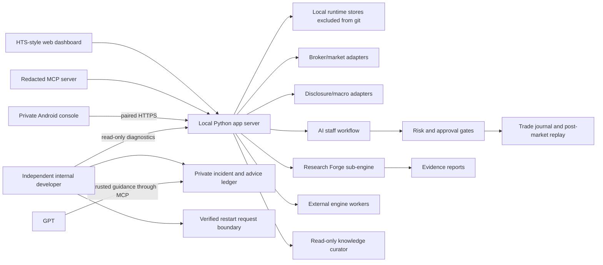

# CodexStock

CodexStock is a local-first AI investment research, validation, and trading-operations platform.

It combines market monitoring, candidate discovery, strategy research, paper/live separation, AI staff reviews, MCP access, post-market replay, and safety-first trade reconciliation into one personal workstation.

Created and maintained by **Jinwoo Kim** (`burunchhehe`).

> **Evaluation only. All rights reserved.** This repository is public so people and developers can inspect CodexStock and provide feedback. It is **not open source** and does not grant permission to use, copy, modify, redistribute, deploy, sell, or build a service from the code. Prior written permission from the owner is required. See [LICENSE](LICENSE).

> **평가·피드백 열람 전용입니다.** 사람들이 코덱스스톡의 기능과 설계를 살펴보고 의견을 남길 수 있도록 공개한 저장소이며 오픈소스가 아닙니다. 소유자의 사전 서면 허가 없이 사용·복제·수정·재배포·서비스 운영·판매할 수 없습니다.

## 2026-07-22 지식 큐레이터·안드로이드 앱 업데이트

오늘 오전에는 누적되는 회의·연구·복기·후보 판단을 정리하고 다시 찾아주는 **지식 큐레이터**를 만들었고, 저녁에는 집 PC의 코덱스스톡을 개인 안드로이드 기기에서 확인하는 **모바일 콘솔**을 실제로 연결했습니다.

### 오전: 지식 큐레이터

- AI 회의, 학습 통찰, 조건검색, 장후 복기, 외부신호 검증, 후보 판단, 전략 연구를 읽기 전용으로 색인합니다.
- 원본 경로·위치·발생시각·내용 해시를 보존하고, 변경되지 않은 자료와 중복 투영을 다시 처리하지 않습니다.
- JSONL 원장은 마지막 읽은 위치 이후의 추가분만 처리해 상시 작업을 가볍게 유지합니다.
- SQLite FTS5/BM25는 즉시 검색, Qdrant는 경량 유사 검색, LlamaIndex는 긴 문서 분할 검색을 담당합니다.
- Graphiti와 Microsoft GraphRAG는 장후·휴장일 요청형 실험으로 분리했습니다.
- 계좌·잔고·주문·체결·토큰·비밀번호·API 키 관련 테이블과 열은 색인에서 제외합니다.
- 2026-07-22 확인 시점에 7,871개 문서와 23개 상시 소스를 색인했고 스케줄러가 정상 실행 중이었습니다.


### 저녁: 안드로이드 모바일 콘솔

- PC 주소와 만료되는 일회용 코드로 개인 기기를 연결합니다.
- 장기 기기 토큰은 원문이 아니라 해시만 PC에 저장하며, 기기별로 폐기할 수 있습니다.
- 운영 상태, 업무 집중도, 자동운용·외부 실행기, 추천·관찰 후보, AI 직원, 하위엔진, 내부 개발자 사건을 모바일에서 확인합니다.
- 비서는 읽기 전용으로 제한하고, 직접 매수·매도, 자동운용 시작, 위험 한도 완화, 인증정보 열람은 차단합니다.
- 실제 안드로이드 기기 연결, 모바일 화면, 토큰 폐기, Android test/lint, `npm audit`, APK 서명을 검증했습니다.


상세 구현은 [지식 큐레이터](docs/KNOWLEDGE_CURATOR.md), [모바일 콘솔](docs/MOBILE_CONSOLE.md), [2026-07-22 검증 보고서](docs/VERIFIED_UPGRADE_2026-07-22.md)에서 확인할 수 있습니다.

## 2026-07-20 검증 업데이트

오늘 업데이트는 코덱스스톡의 판단부와 주문 집행부를 분리하고, 외부 연구 엔진이 실제로 왕복 실행되는지를 더 엄격하게 확인하는 데 집중했습니다.

- **외부 자동집행기 관측판**: 실행기 연결 상태, 하트비트, 처리·대기 신호, Shadow 관찰 시간, 후보 증거 진행률을 실행기 화면에서 확인합니다.
- **안전한 Shadow 실행 구조**: 코덱스스톡이 만든 주문 의도를 별도 규칙 기반 실행기가 다시 검사합니다. 현재 공개 검증 상태에서는 실전 주문이 차단되어 있습니다.
- **NautilusTrader WSL2 격리 연동**: Windows 코드 무결성 정책과 충돌한 네이티브 모듈을 우회하지 않고, 격리된 Linux 런타임에서 실제 엔진을 실행하도록 연결했습니다.
- **체결 현실성 검증**: 부분 체결, 의도적 미체결, 주문 삽입 지연, 실제 호가장 증거를 포함한 NautilusTrader 왕복 테스트를 통과했습니다.
- **9개 하위엔진 운영 대사**: 9개 엔진 슬롯의 정식 연결 상태와 왕복 실행 증거를 같은 상태판에서 대사하도록 정리했습니다.
- **실패 원인 보존**: 시간 초과, 프로세스 반환 코드, 전체 worker JSON, Windows 코드 무결성 차단 여부를 진단 결과에 보존합니다.

이 검증은 **기술적 연결과 안전 경계**에 대한 증거입니다. 투자 수익률이나 실전 운용 성과를 증명하지 않으며, 외부 자동집행기는 장시간 Shadow 관찰과 증권사 체결 예외 검증이 끝나기 전까지 실전 자동주문을 수행하지 않습니다.

상세 내용과 검증 범위는 [2026-07-20 검증 보고서](docs/VERIFIED_UPGRADE_2026-07-20.md)에서 확인할 수 있습니다.

## 30초 요약 | CodexStock at a Glance

코덱스스톡은 단순 종목 추천기나 백테스트 스크립트가 아닙니다. 개인 투자자가 장전 준비부터 장중 감시, 후보 검토, 위험 통제, 주문 기록, 장후 복기와 다음 전략 개선까지 하나의 흐름으로 운영하기 위해 만든 **로컬 우선 AI 투자 연구·운영 플랫폼**입니다.

```text
시장·뉴스·공시·수급 감시
    -> 후보 발굴과 근거 정리
    -> 역할별 AI 직원 검토
    -> 리스크·집중도·위임 한도 점검
    -> Paper/실전 경계가 있는 실행 계획
    -> 주문·체결·잔고·손익 대사
    -> 장후 복기·놓친 종목 분석·매매일지
    -> 검증된 교훈만 다음 판단에 반영
```

### 무엇을 할 수 있나

| 영역 | 구현된 핵심 기능 |
| --- | --- |
| 시장 감시 | 관심종목, 거래대금·등락·유동성 레이더, 업종·테마, 뉴스·공시·거시 신호 수집 |
| 후보 발굴 | 단타·스윙·중기·장기 후보 분리, 근거 점수, 중복 가점 억제, 업종 편중 경고 |
| AI 직원 조직 | 연구·수급·재무·전략·매매·리스크·보고 역할이 서로 다른 근거를 남기는 7개 역할 기반 워크플로 |
| 전략 연구 | Research Forge, 워크포워드, 리플레이, 거래비용·슬리피지, 시장국면·체결조건 검증 |
| 하위엔진 활용 | 외부 정보 탐색, KIS 공식 게이트웨이와 선택형 퀀트·백테스트 엔진을 본체의 검증 절차로 통합 |
| 실행 안전 | Paper/실전 분리, 위임 한도, 승인·차단 게이트, 주문 의도와 매수·매도 사유 기록 |
| 사후 대사 | 주문·체결·잔고·손익을 다시 맞춰 보고 불일치와 설명되지 않은 차이를 탐지 |
| 장후 학습 | 선택·탈락·놓친 종목, 진입·청산 타이밍, 재료와 시장 흐름을 반복 복기하고 다음 개선 과제로 연결 |
| GPT/MCP | 로컬 전체 기능을 조회·진단하는 MCP와, 민감정보·실전 주문을 제외한 공개용 읽기 전용 20개 도구 |
| 자체 진단·복구 | 1분 심장박동, 장애 분류, Telegram 보고, 안전한 허용목록 복구, GPT 외부 자문 저장과 재검증 |
| 지식 큐레이터 | 회의·복기·연구·후보·외부 신호를 증분 색인하고 출처·시각·해시를 보존해 AI 직원이 다시 찾도록 지원 |
| 안드로이드 콘솔 | 개인 HTTPS 연결, 일회용 페어링, 해시 토큰, 운영 상태·후보·직원·엔진·사건 조회, 읽기 전용 비서 |

### 2026-07-19 확인 스냅샷

- **AI 업무 역할 7개**: 연구, 수급, 재무, 전략, 매매, 리스크, 보고
- **하위엔진 9개 운영판**: 가벼운 상태 감시와 요청형 무거운 연구를 분리
- **로컬 MCP 기능 170개**: 상태·연구·복기·대사·외부엔진·내부개발자 기능을 GPT에서 조회 가능한 구조
- **공개 MCP 20개**: 계좌·잔고·체결·주문·개인 기록을 제외한 읽기 전용 연구 체험판
- **장애 대응 왕복 검증**: 내부 개발자 감지 → Telegram 단일 보고 → GPT/MCP 자문 → 정책 검사 → 로컬 재검증
- **안전 경계**: 내부 개발자와 외부 하위엔진은 실전 주문, 소스코드 임의 수정, API 키 변경, 보안 해제를 수행할 수 없음

이 숫자는 투자성과나 수익을 증명하는 수치가 아니라 **구현된 기능 표면과 운영 검증 범위**를 나타냅니다. 장기 성과는 별도의 순방향 Paper/실운용 기간과 데이터 품질 증거가 더 필요합니다.

실제 화면은 [Actual UI Screenshots](#actual-ui-screenshots), 전체 기능은 [Feature Map](docs/FEATURES.md), 하위엔진 역할은 [Sub-Engines](docs/SUB_ENGINES.md), 자체 진단·복구 검증은 [Verified Upgrade](docs/VERIFIED_UPGRADE_2026-07-19.md)에서 확인할 수 있습니다.

> This repository is a public evaluation build. It contains source code and non-confidential documentation only. It does not contain API keys, account numbers, live order logs, private journals, runtime databases, or personal trading records.

## Why It Exists

Most personal trading projects stop at one of these layers:

- a screener
- a backtester
- a broker API wrapper
- a dashboard
- an LLM chat helper

CodexStock is built as an operating loop instead:

```text
market data -> candidates -> AI staff review -> risk gate -> paper/live plan
            -> order/fill/account reconciliation -> journal -> post-market replay
            -> strategy improvement -> next session
```

The goal is not to claim guaranteed returns. The goal is to make the research, decision, execution, review, and improvement process auditable.

## 2026-07-19 Verified Upgrade

The current upgrade adds a bounded internal-developer and recovery loop. It is deliberately separate from the trading decision path: it can observe, diagnose, report, and run a small allowlist of operational recoveries, but it cannot place orders, edit source code, change credentials, relax risk limits, or disable security controls.

```text
heartbeat and read-only diagnostics
    -> incident classification
    -> safe allowlisted recovery or report-only escalation
    -> Telegram and launcher status
    -> GPT reads the report through MCP
    -> external advice is stored as untrusted guidance
    -> local policy validates structured actions
    -> bounded handler runs and is reverified
    -> recovery evidence and history are preserved
```

New capabilities in this upgrade:

- independent one-minute internal-developer sidecar with single-instance protection
- busy/progress-aware watchdog logic that does not restart healthy long-running work
- atomic incident, report, advice, event, and verified-playbook ledgers
- nine read-only/internal-developer MCP operations for status, incidents, reports, diagnostics, and external guidance intake
- Telegram incident reporting through the existing reporting queue rather than a second bot receiver
- draggable launcher health dock with healthy, attention, incident, and recovered states
- direct operational-status replies that bypass the local LLM when a deterministic answer is available
- local-only Ollama startup recovery with a CPU fallback for an incompatible GPU runtime

Verification performed on 2026-07-19:

- Python compile checks passed for the app, MCP server, and internal-developer modules
- JavaScript syntax check passed for the launcher UI
- 79 focused internal-developer, policy, scheduler, MCP, storage, and end-to-end tests passed
- a synthetic incident completed the Telegram -> GPT/MCP advice -> policy check -> local revalidation loop
- dangerous or malformed advice was quarantined; no order, code, credential, security, or risk-policy mutation was executed
- the live read-only launcher endpoint reported a fresh heartbeat, zero real open incidents, and `RECOVERED` status at verification time
- an Ollama stop/start drill recovered the local service and returned a model response; the operator model configuration was restored afterward

See [docs/VERIFIED_UPGRADE_2026-07-19.md](docs/VERIFIED_UPGRADE_2026-07-19.md) and [docs/INTERNAL_DEVELOPER.md](docs/INTERNAL_DEVELOPER.md) for the evidence and safety boundaries.

## What Was Built And Why

CodexStock was built around one question: how can a personal investor turn scattered market data, AI opinions, strategy tests, order decisions, and daily reviews into one repeatable operating system?

| Purpose | Implemented Feature | Why It Matters |
| --- | --- | --- |
| Avoid random stock picking | Market radar, watchlists, movers, sector/theme checks, and external signal intake | Candidates should come from observable market strength, liquidity, news, and repeatable filters instead of memory or impulse |
| Make AI decisions inspectable | AI staff roles for research, supply/demand, fundamentals, strategy, trading, risk, and reporting | Each candidate can be reviewed from multiple angles before it reaches a trading plan |
| Stop one model from overruling risk | Risk manager, approval gates, concentration checks, delegated-limit controls, and live/paper separation | The system can generate ideas aggressively while keeping execution behind explicit safety rules |
| Separate research from execution | Research Forge, backtest workers, replay jobs, and paper/live state boundaries | Heavy experiments can run without interfering with intraday monitoring or live-trading safety |
| Learn from every session | Post-market replay, missed-name review, trade journal, learning traces, and next-cycle improvement notes | The system records why a stock was selected, rejected, bought, sold, or missed so the next session can improve |
| Verify instead of trusting outputs | Walk-forward validation, replay evidence, reconciliation checks, and test reports | Strategy results and operational claims need evidence, not just summaries |
| Keep GPT access useful but safe | Redacted MCP tools for health, candidates, reports, staff summaries, learning state, and external signals | GPT can inspect and explain the system without receiving private account data or credentials |
| Detect and recover from operational faults | Independent internal developer, heartbeat/progress classifier, allowlisted handlers, incident ledger, and launcher health dock | Routine faults can be diagnosed and safely recovered while dangerous changes remain report-only |
| Use external technical advice safely | GPT/MCP report reader, untrusted advice store, strict action schema, quarantine, and post-action verification | Higher-level advice can be reviewed and applied only through pre-registered local handlers |
| Protect private runtime data | Source/runtime separation, `.env.example`, excluded databases, and credential-free public build | The public repository can be reviewed without exposing personal trading records, keys, or account information |

## Core Capabilities

| Area | What CodexStock Provides |
| --- | --- |
| Market radar | Intraday radar, watchlist context, sector/theme checks, external signal inbox |
| Candidate discovery | Screeners, momentum/liquidity filters, candidate scoring, AI decision context |
| AI staff workflow | Research, supply/demand, fundamentals, strategy, trading, risk, and reporting roles |
| Research Forge | Reproducible research engine for walk-forward validation, replay, reports, and evidence bundles |
| Sub-engine orchestration | Research Forge, external signal scout, KIS gateway, and optional quant/backtest workers |
| Backtest/replay | Historical training, daily replay, missed-name review, replay evidence, learning traces |
| Trading operations | Paper/live separation, delegated limits, order intent logs, reconciliation-oriented state machine |
| GPT/MCP access | Redacted local MCP tools for status, candidates, reports, and learning summaries |
| Internal developer | Independent diagnostics, incident reports, safe recovery allowlist, GPT advice bridge, recovery verification |
| Operational visibility | One-minute heartbeat, Telegram alerts, launcher health dock, incident/advice/report history |
| Knowledge curator | Incremental immutable-source indexing, FTS/BM25 retrieval, optional Qdrant/LlamaIndex/graph projections |
| Android console | Private paired-device status, candidates, staff, engines, incidents, and read-only assistant |
| Safety | Read-only defaults, explicit live-trading gates, credential exclusion, runtime/source separation |

See [docs/FEATURES.md](docs/FEATURES.md) for a fuller feature map.
See [docs/SUB_ENGINES.md](docs/SUB_ENGINES.md) for the sub-engine strategy.
See [playmcp-public-version/](playmcp-public-version/) for the PlayMCP-ready public read-only MCP preview.

## Actual UI Screenshots

These are selected real CodexStock UI captures. They were included because they do not show account numbers, balances, tokens, private journals, live positions, or real order/fill logs.


## Verified Recovery Drill Screenshots

The following captures are from a controlled operational drill, not a live-trading incident. No live order, account mutation, credential change, source-code edit, or security-policy change was executed.

### Telegram Report To GPT Advice Roundtrip

The first capture shows the same drill progressing across three surfaces: the internal developer sends one Telegram incident report through the existing reporting queue, GPT reads the stored incident through MCP, and the structured `WRITE_INCIDENT_REPORT` guidance is accepted as report-only advice.


### Launcher Health Dock

The second capture shows the launcher while the synthetic incident is active. The dock exposes the detected issue, heartbeat age, real-incident count, GPT advice count, incident history, quarantine state, and the latest safely accepted guidance. It is draggable so it does not cover other controls.


After the drill, the same read-only endpoint reported a fresh heartbeat, zero real open incidents, and `RECOVERED` status. See [the verification report](docs/VERIFIED_UPGRADE_2026-07-19.md) for the exact boundary and checks.

## Architecture



See [docs/ARCHITECTURE.md](docs/ARCHITECTURE.md) for details.

## Safety Boundaries

CodexStock separates source code from private runtime state.

This repository intentionally excludes:

- `.env`, `.env.local`, and all real credentials
- broker API keys, tokens, account numbers, approval phrases, and chat IDs
- live account snapshots, order logs, fill logs, reconciliation logs, and PnL logs
- private trading journals, Telegram logs, staff long-memory files, and watchlists
- generated databases, archives, reports, builds, and third-party source vaults

Live trading is disabled by default and must only be enabled in a private local runtime with user-owned credentials and explicit safety gates.

The internal developer is not an unrestricted coding agent. Its automatic action set is intentionally limited to registered cache refreshes, registered external-engine reconnects, one bounded retry of eligible research work, internal ledger rebuilds, read-only database-lock detection, restart requests for the independent watchdog, and report writing. Everything else is quarantined or escalated.

## Repository Layout

| Path | Purpose |
| --- | --- |
| `app/` | Local app server, integrations, MCP bridge, operational logic |
| `app/internal_developer_*.py` | Independent storage, policy engine, and read-only recovery sidecar |
| `app/knowledge_curator.py` | Immutable-source projection, incremental indexing, search, and specialist scheduling |
| `app/mobile_console.py` | One-time pairing, hashed device tokens, read-only mobile command boundary |
| `app/web/` | Browser dashboard UI |
| `app/web/mobile/` | Mobile-first private operations console |
| `mobile/codexstock-android/` | Capacitor Android wrapper and reproducible Gradle project |
| `packages/stock_suite/` | Reusable stock-suite package facade |
| `packages/codexstock_research_forge/` | Research-only validation engine |
| `tools/` | Local verification, gateway, and worker scripts |
| `tools/run_internal_developer.ps1` | One safe internal-developer cycle for local diagnostics |
| `tests/` | Regression tests for safety, MCP contracts, replay, research, and reconciliation |
| `docs/` | Public documentation and evaluation notes |
| `.env.example` | Empty configuration template |

## Quick Start

```powershell
python -m venv .venv
.\.venv\Scripts\Activate.ps1
python -m pip install -e .
python -m stock_suite status
```

Run the local app:

```powershell
Copy-Item .env.example .env.local
.\run_app.ps1
```

Fill `.env.local` only with your own credentials. Never commit it.

## Validation

```powershell
python -m py_compile app\stock_suite_app.py app\codexstock_mcp_server.py
node --check app\web\app.js
python -m pytest tests
```

Focused internal-developer verification:

```powershell
python -m unittest `
  tests.test_internal_developer_store `
  tests.test_internal_developer_engine `
  tests.test_internal_developer_service `
  tests.test_internal_developer_end_to_end `
  tests.test_mcp_internal_developer_bridge `
  tests.test_internal_developer_scheduler_contract
```

The full test suite may require optional local dependencies and configured mock providers. Syntax checks should work on a basic clone.

## Public MCP Strategy

The internal system has a broad tool surface, but a public MCP should be compact, read-only, and easy for an LLM to choose correctly.

Recommended public surface: 18-20 read-only tools covering market brief, candidate review, strategy validation, paper replay, risk scenario, post-market review, learning report, staff summary, external signal summary, and health.

Live order submission, account mutation, and exact private-account details should not be exposed.

See [docs/PUBLIC_MCP_SURFACE.md](docs/PUBLIC_MCP_SURFACE.md).

## Current Status

CodexStock is an active personal research platform, not a certified financial product.

Strong areas:

- large integrated local workflow
- strong safety separation concept
- AI staff/review loop
- Research Forge integration
- MCP-ready redacted status surface
- post-market review and learning evidence direction
- bounded self-diagnostics and safe recovery sidecar
- Telegram, launcher, and GPT/MCP incident visibility
- verified external-advice intake with strict quarantine and revalidation

Still needs long-horizon proof:

- forward paper/live observation over time
- stricter point-in-time market universe evidence
- verified corporate-action histories
- broader out-of-sample and stress validation
- production-grade packaging and onboarding

See [docs/ROADMAP.md](docs/ROADMAP.md).

## Disclaimer

CodexStock is research software. It is not investment advice, a broker, a fiduciary, or a profit guarantee.

Backtests, paper results, AI-generated explanations, and strategy reports can be wrong, overfit, delayed, incomplete, or unsuitable for real capital. Use at your own risk.

