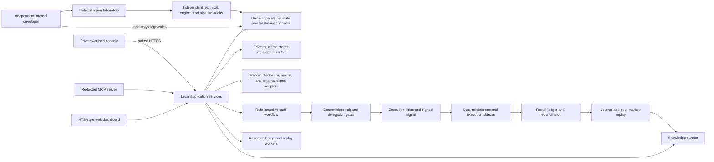
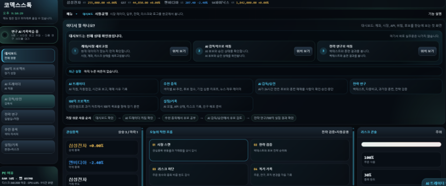
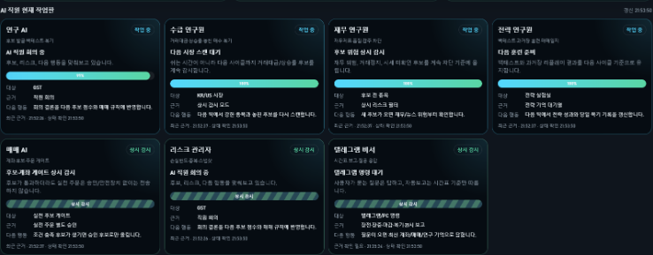
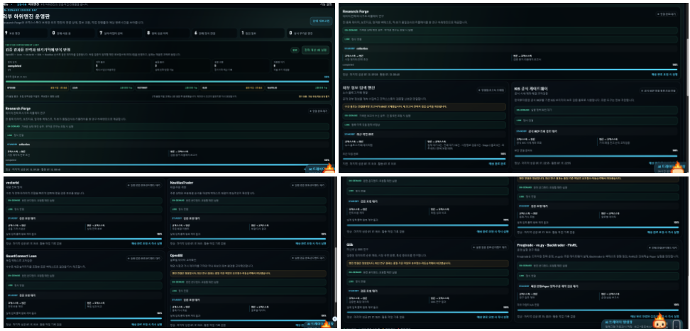
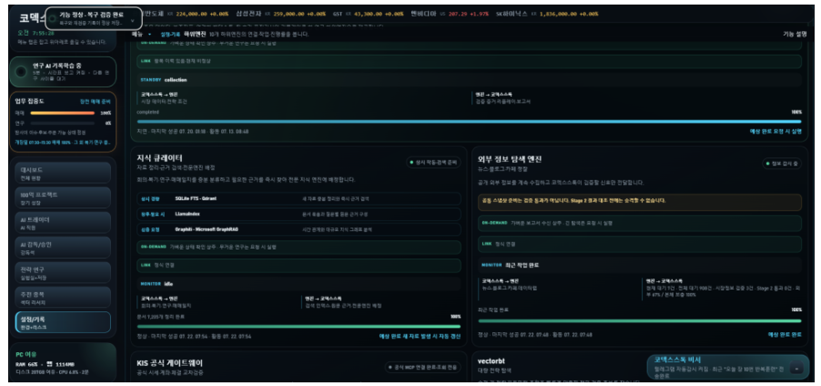
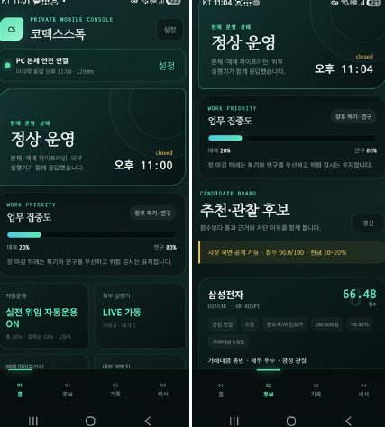

# CodexStock v6

CodexStock is a **local-first AI investment research, validation, and trading-operations platform**.

It connects market monitoring, candidate discovery, role-based AI review, strategy research, deterministic risk controls, execution evidence, reconciliation, post-market replay, knowledge retrieval, operational audit, and bounded self-repair in one personal workstation.

Created and maintained by **Jinwoo Kim** (`burunchhehe`).

> **Evaluation only. All rights reserved.** This repository is public so people and developers can inspect CodexStock and provide feedback. It is **not open source** and does not grant permission to use, copy, modify, redistribute, deploy, sell, or build a service from the code. Prior written permission from the owner is required. See [LICENSE](LICENSE).
>
> **평가·피드백 열람 전용입니다.** 사람들이 코덱스스톡의 기능과 설계를 살펴보고 의견을 남길 수 있도록 공개한 저장소이며 오픈소스가 아닙니다. 소유자의 사전 서면 허가 없이 사용·복제·수정·재배포·서비스 운영·판매할 수 없습니다.

## CodexStock v6 at a Glance

CodexStock v6 is not a stock recommender, a single backtest script, or an LLM trading bot. It is an evidence-aware operating system for a personal investment workflow.

```text
market, news, disclosure, flow, and macro monitoring
    -> candidate discovery and evidence collection
    -> role-based AI staff review
    -> strategy, regime, and execution validation
    -> deterministic risk and delegation checks
    -> order intent, signed signal, and external execution sidecar
    -> order, fill, account, and PnL reconciliation
    -> post-market replay, missed-opportunity review, and journal
    -> provenance-aware knowledge retrieval
    -> technical, sub-engine, and trading-pipeline audit
    -> bounded recovery and independently verified closure
```

The objective is not to claim guaranteed returns. The objective is to make research, decisions, execution, review, learning, and operational recovery inspectable and reproducible.

## What Changed in v6

v6 focuses on removing architectural debt rather than merely adding more screens or tools.

| Before | CodexStock v6 |
| --- | --- |
| A large application module assembled many operational states directly | Operational reliability responsibilities are separated into dedicated services and contracts |
| Component existence or connectivity could be mistaken for health | Code presence, connection, freshness, last success, end-to-end success, and current eligibility are distinguished |
| Candidate, order intent, external executor, and result evidence were inspected in separate places | The trading pipeline is traced from candidate evidence through signed signal, executor result, and reconciliation |
| Knowledge retrieval was measured mainly by indexed volume | Retrieval evidence can be attached to decisions and reviewed for actual contribution |
| Recovery could stop after a repair candidate or local test | Detection, diagnosis, isolated repair, review, bounded testing, protected-file checks, deployment decision, and revalidation form a closed loop |
| Runtime data and logs accumulated under mixed rules | Retention, archive, exclusion, and cleanup responsibilities are explicitly separated |
| Operational faults and normal strategy losses could be mixed in one failure narrative | Infrastructure, data, execution, policy, and strategy outcomes are classified separately |
| Non-terminal timing warnings could trigger repeated repair activity | Shared-cycle SLA accounting and terminal-failure gates prevent repair storms |

## Core Capabilities

| Area | Implemented capability |
| --- | --- |
| Market monitoring | Watchlists, movers, liquidity, sector/theme context, news, disclosures, macro signals, and external signal intake |
| Candidate discovery | Intraday, swing, medium-term, and long-term candidate separation with evidence scoring, duplicate-score control, and concentration warnings |
| AI staff workflow | Distinct research, supply/demand, fundamentals, strategy, trading, risk, and reporting responsibilities |
| Research Forge | Reproducible research jobs, walk-forward validation, replay, cost and slippage assumptions, dataset lineage, and evidence bundles |
| Model orchestration | Local language models for research and review, coding models for isolated repair candidates, embeddings for retrieval, and deterministic rules for execution |
| Execution safety | Paper/live separation, delegated limits, approval contracts, emergency stop, expiry, duplication, exposure, account, and price-bound checks |
| External execution sidecar | Generative analysis is separated from a deterministic executor that independently validates signed signals |
| Reconciliation | Order, fill, account, position, cash, and PnL evidence are compared and unexplained differences are surfaced |
| Post-market learning | Selected, rejected, missed, entered, and exited names are replayed and linked to the next improvement cycle |
| Knowledge curator | Incremental source indexing, immutable-original handling, provenance, freshness, FTS/BM25, vector retrieval, and optional graph projections |
| Operational audit | Technical audit, sub-engine audit, and end-to-end trading-pipeline audit are separated from the component being assessed |
| Internal developer | Health observation, incident classification, safe allowlisted recovery, isolated Aider/Qwen repair candidates, review, tests, and revalidation |
| MCP access | Broad local inspection tools and a compact public read-only surface that excludes credentials, private account data, and live-order submission |
| Android console | Paired-device access to health, work focus, candidates, staff, engines, incidents, recovery history, and emergency stop |

## Evidence-Aware Operations

CodexStock v6 separates states that are often incorrectly collapsed into one green indicator:

1. the code or adapter exists;
2. the component is configured or connected;
3. recent evidence is fresh;
4. the last invocation succeeded;
5. the full workflow reached its required next stage;
6. the function is currently eligible to operate.

A running web server therefore does not prove that candidate discovery, validation, signal publication, external execution, result ingestion, and reconciliation are all healthy.

AI staff and engine status can include heartbeat, evidence age, last success, current progress, decision eligibility, and the next required action. System health and trading-pipeline health are evaluated separately.

## Deterministic Trading Pipeline

```text
scan
  -> validate
  -> role-based review
  -> risk decision
  -> execution ticket
  -> signed signal
  -> deterministic sidecar
  -> broker or shadow result
  -> result ledger
  -> reconciliation
```

The external execution sidecar independently checks mode, signal expiry, duplication, account availability, exposure, price bounds, emergency-stop state, and the applicable approval contract.

Semi-automatic and delegated automatic operation use separate contracts. Public MCP tools remain read-only and cannot submit live orders.

## Internal Developer and Repair Laboratory

The internal developer is intentionally separated from the trading-decision path. It observes runtime health, APIs, data freshness, work-skill completion, external engines, and selected business-pipeline evidence.

The bounded repair workflow is:

1. detect an abnormal condition;
2. diagnose and classify the failure;
3. attempt a registered safe recovery where applicable;
4. create an isolated Git repair workspace when code repair is justified;
5. run a bounded coding model through Aider;
6. execute approved tests and protected-file checks;
7. review, stage, and close only after independent revalidation evidence exists.

A non-terminal warning cannot launch code repair. Shared daemon work uses shared-cycle SLA accounting so one short task inside a longer cycle is not falsely declared stalled.

Production credentials, account data, live-order authority, risk-limit relaxation, security disabling, and unreviewed deployment remain outside this repair path.

## Independent Audit Roles

The developer and the verifier are not treated as the same role.

- **Technical audit** checks runtime, API, storage, resource, retention, and regression evidence.
- **Sub-engine audit** checks adapter availability, round-trip execution, freshness, and returned evidence.
- **Trading-pipeline audit** checks whether each stage reached the next required stage and whether results returned to the ledger.

A repair candidate is not considered successful merely because it was generated or because its own local test passed. Closure requires the applicable independent verification evidence.

## Knowledge Curator

The knowledge layer organizes research notes, market reviews, staff lessons, candidate decisions, external research, and failure evidence so later decisions can retrieve relevant material instead of repeatedly scanning all historical files.

Operational retrieval includes:

- incremental indexing and duplicate suppression;
- immutable-original handling;
- source, timestamp, freshness, evidence grade, and provenance metadata;
- SQLite FTS5/BM25 retrieval;
- optional Qdrant and LlamaIndex paths;
- BGE-M3-compatible embeddings;
- optional graph projections for entity and relationship exploration;
- retrieval evidence that can be attached to later decisions and reviews.

Document and vector retrieval are the primary operational path. Graph projections remain an evolving research layer and are not represented as complete knowledge.

## Current Verification Evidence

The latest public verification note records:

- evidence-aware staff and engine status;
- deterministic execution-sidecar separation;
- technical, sub-engine, and trading-pipeline monitoring;
- seven-stage isolated recovery and repair review;
- protected-file checks and bounded model escalation;
- shared-cycle SLA and repair-storm prevention;
- Android paired-device operations access;
- **1,303 automated regression tests passed** after the repair-stability update.

See [docs/VERIFIED_UPGRADE_2026-07-25.md](docs/VERIFIED_UPGRADE_2026-07-25.md) for the implementation-oriented evidence and limits.

This evidence demonstrates implemented behavior and engineering checks. It does **not** demonstrate investment profitability.

## Architecture


```mermaid
flowchart LR
    UI["HTS-style web dashboard"] --> APP["Local application services"]
    MCP["Redacted MCP server"] --> APP
    MOBILE["Private Android console"] -->|"paired HTTPS"| APP

    APP --> STATE["Unified operational state and freshness contracts"]
    APP --> DATA["Private runtime stores excluded from Git"]
    APP --> MARKET["Market, disclosure, macro, and external signal adapters"]
    APP --> STAFF["Role-based AI staff workflow"]
    APP --> FORGE["Research Forge and replay workers"]
    APP --> CURATOR["Knowledge curator"]

    STAFF --> RISK["Deterministic risk and delegation gates"]
    RISK --> TICKET["Execution ticket and signed signal"]
    TICKET --> SIDECAR["Deterministic external execution sidecar"]
    SIDECAR --> RESULT["Result ledger and reconciliation"]

    DEV["Independent internal developer"] -->|"read-only diagnostics"| STATE
    DEV --> REPAIR["Isolated repair laboratory"]
    AUDIT["Independent technical, engine, and pipeline audits"] --> STATE
    REPAIR --> AUDIT

    RESULT --> JOURNAL["Journal and post-market replay"]
    JOURNAL --> CURATOR
```

See [docs/ARCHITECTURE.md](docs/ARCHITECTURE.md) and [docs/FEATURES.md](docs/FEATURES.md) for additional detail.

## Actual UI

The repository includes selected real CodexStock captures that exclude account numbers, balances, tokens, private journals, live positions, and real order/fill logs.












## Safety Boundaries

CodexStock separates public source code from private runtime state.

This repository intentionally excludes:

- `.env`, `.env.local`, and real credentials;
- broker API keys, tokens, account numbers, approval phrases, and chat IDs;
- live account snapshots, order logs, fill logs, reconciliation logs, and PnL logs;
- private journals, Telegram logs, staff long-memory files, and watchlists;
- generated databases, archives, reports, builds, and third-party source vaults.

Live trading is disabled by default and must only be enabled in a private local runtime with user-owned credentials and explicit safety gates.

The internal developer is not an unrestricted coding agent. Automatic actions are limited to registered recovery handlers and bounded repair procedures. Unsupported or dangerous actions are quarantined or escalated.

## Repository Layout

| Path | Purpose |
| --- | --- |
| `app/` | Local application services, integrations, MCP bridge, operational logic |
| `app/internal_developer_*.py` | Independent diagnostics, policy, incident, recovery, and repair workflow |
| `app/knowledge_curator.py` | Incremental indexing, retrieval, provenance, and specialist scheduling |
| `app/mobile_console.py` | Pairing, hashed device tokens, and mobile command boundary |
| `app/web/` | Browser dashboard UI |
| `app/web/mobile/` | Mobile-first private operations console |
| `mobile/codexstock-android/` | Capacitor Android wrapper and Gradle project |
| `packages/stock_suite/` | Reusable stock-suite package facade |
| `packages/codexstock_research_forge/` | Research-only validation engine |
| `tools/` | Verification, gateway, audit, migration, and worker scripts |
| `tests/` | Regression tests for safety, MCP contracts, replay, research, repair, and reconciliation |
| `docs/` | Public architecture, feature, safety, and verification notes |
| `playmcp-public-version/` | Public read-only MCP preview |
| `.env.example` | Empty configuration template |

## Quick Start

```powershell
python -m venv .venv
.\.venv\Scripts\Activate.ps1
python -m pip install -e .
python -m stock_suite status
```

Run the local application:

```powershell
Copy-Item .env.example .env.local
.\run_app.ps1
```

Fill `.env.local` only with your own credentials. Never commit it.

## Validation

```powershell
python -m py_compile app\stock_suite_app.py app\codexstock_mcp_server.py
node --check app\web\app.js
python -m pytest tests
```

The full suite may require optional local dependencies and configured mock providers. Basic syntax checks should work on a standard clone.

## Public MCP Strategy

The local system has a broad inspection surface, while the public MCP is intentionally compact, read-only, and easier for an LLM to select correctly.

It covers market context, candidate review, strategy validation, paper replay, risk scenarios, post-market review, learning reports, staff summaries, external signals, and health without exposing live-order submission, account mutation, credentials, or exact private-account details.

See [docs/PUBLIC_MCP_SURFACE.md](docs/PUBLIC_MCP_SURFACE.md) and [playmcp-public-version/](playmcp-public-version/).

## Current Status

CodexStock v6 is an active personal research and trading-operations platform, not a certified financial product.

The engineering platform now includes separated operational services, unified state and freshness interpretation, end-to-end execution evidence, contribution-aware knowledge retrieval, closed-loop repair verification, explicit retention responsibilities, and failure taxonomy that separates operational faults from normal strategy outcomes.

The remaining proof is primarily longitudinal rather than architectural:

- long-horizon forward Paper and carefully governed live observation;
- stricter point-in-time universe and corporate-action evidence;
- broader out-of-sample, regime, liquidity, and stress validation;
- measured learning contribution over repeated comparable periods;
- production-grade packaging, onboarding, and operator documentation.

See [docs/ROADMAP.md](docs/ROADMAP.md).

## Disclaimer

CodexStock is research software. It is not investment advice, a broker, a fiduciary, or a profit guarantee.

Backtests, paper results, AI-generated explanations, strategy reports, and operational status can be wrong, overfit, delayed, incomplete, or unsuitable for real capital. Use at your own risk.
