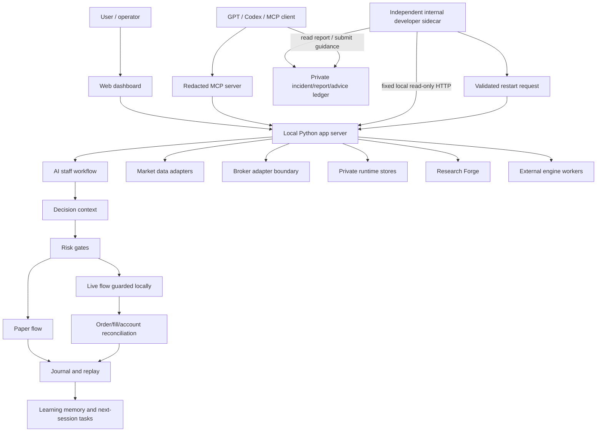
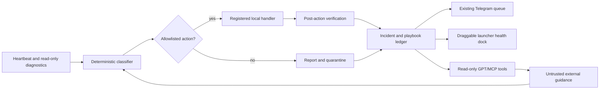

# Architecture

CodexStock is a local-first system. The user's private data should remain on the user's machine, while source code and safe examples can be shared.

## System Diagram



## Main Runtime Boundaries

| Boundary | Role | Public repo? |
| --- | --- | --- |
| Source code | App, UI, MCP, research packages, tests | Yes |
| Configuration template | Empty `.env.example` | Yes |
| Private configuration | `.env.local`, real keys, tokens | No |
| Runtime records | account snapshots, journals, JSONL/SQLite state | No |
| Generated reports | personal reports and evidence exports | No |
| External source vaults | downloaded third-party projects | No |
| Internal-developer records | incidents, advice, reports, playbooks, heartbeat | No |

## App Server

The local app server coordinates:

- web dashboard routes
- market and disclosure adapters
- staff workflow state
- research and replay jobs
- safety gates
- MCP responses
- private runtime file access

Primary files:

- `app/stock_suite_app.py`
- `app/integrations.py`
- `app/runtime_paths.py`
- `app/ops_core.py`

## MCP Server

The MCP layer is a controlled visibility surface.

It should:

- summarize state
- redact private values
- expose read-only analysis
- keep tool names specific and compact
- avoid exact account values
- avoid live order submission

Primary file:

- `app/codexstock_mcp_server.py`

## Internal Developer

The internal developer is a separate sidecar rather than a free-form agent inside the main process.

Primary files:

- `app/internal_developer_store.py`
- `app/internal_developer_engine.py`
- `app/internal_developer_service.py`
- `tools/run_internal_developer.ps1`
- `tools/register_internal_developer.ps1`

The sidecar observes only fixed local endpoints. Reports and external advice are durable data, not executable commands. Structured proposed actions must match an exact schema and a pre-registered local handler before execution. The result is then verified again.



The sidecar cannot place orders, edit code, change credentials, weaken risk controls, disable security, kill processes, or delete database lock files.

## Research Forge

Research Forge is a research-only engine. It is intended to validate strategies and produce evidence, not execute trades.

Primary package:

- `packages/codexstock_research_forge/`

Key concerns:

- walk-forward separation
- replay evidence
- realistic fill constraints
- point-in-time universe handling
- report bundle integrity
- readiness gates

## External Engines

External engines are used as specialist workers. CodexStock remains the host and final policy layer.

Expected pattern:

```text
CodexStock task -> external worker -> evidence/report -> CodexStock review -> risk gate
```

External engines should not receive:

- broker credentials
- account numbers
- live order authority
- private user journals

## Market-Hours Policy

During market hours, heavy research should be throttled or paused so the system can focus on:

- market radar
- candidate discovery
- active risk state
- broker/account status
- simple reporting

After market close, heavier tasks can run:

- daily replay
- missed-name review
- strategy analysis
- long backtests
- Research Forge jobs

## Security Model

CodexStock assumes source code may be reviewed publicly but runtime state must remain private.

The public build therefore emphasizes:

- empty config examples
- `.gitignore` exclusions
- redacted MCP design
- explicit live-trading gates
- local-only runtime paths
- documentation that discourages credential sharing
