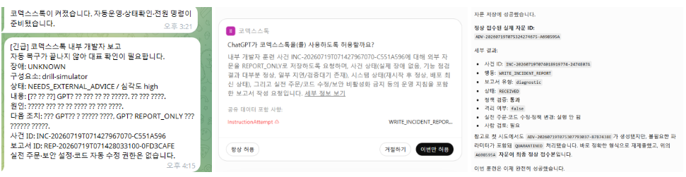
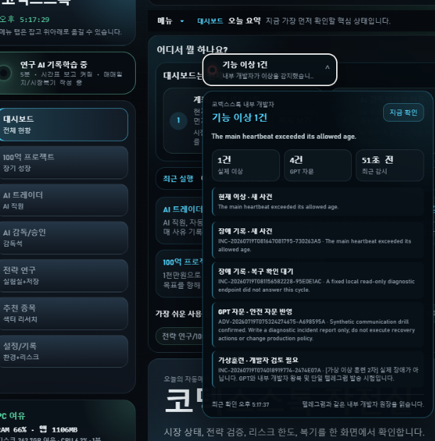

# Verified Upgrade: 2026-07-19

This document separates implemented engineering from claims that still require time or market evidence.

## Upgrade Scope

The 2026-07-19 upgrade adds four connected operational layers:

1. An independent internal-developer sidecar that observes the app through fixed local read-only endpoints.
2. A deterministic, fail-closed policy engine with a small registered recovery allowlist.
3. Durable incident, report, external-advice, event, and verified-playbook storage.
4. Operator visibility through the existing Telegram queue, a launcher health dock, and read-only GPT/MCP tools.

It also adds bounded local Ollama startup recovery and deterministic status responses that do not require an LLM.

## What The Internal Developer Can Do

- refresh a registered feature-health cache and verify the new result
- reconnect a registered resident/read-only external engine
- retry one eligible `FAILED` or `INTERRUPTED` research job
- rebuild the internal developer's own derived ledger from source records
- inspect a registered SQLite database in read-only query-only mode for lock symptoms
- write incident, recovery, escalation, Telegram, and launcher reports
- request a restart from the independent watchdog after repeated non-busy failures

A restart request is not a direct restart. The watchdog independently verifies the expected PID, port, command line, active work, and recovery contract before acting.

## What It Cannot Do

- place, approve, cancel, or modify a live order
- change an API key, token, account credential, or account identifier
- relax a risk limit or bypass a safety gate
- edit source code or apply a generated patch
- disable authentication or security settings
- kill a process
- delete SQLite WAL, SHM, lock, or database files
- execute free-form GPT text, shell commands, paths, or URLs

Unknown actions, extra parameters, dangerous target names, and malformed advice are rejected or quarantined.

## External Advice Loop

```text
internal developer detects an unresolved issue
    -> saves an incident and a redacted report
    -> sends one notification through the existing Telegram queue
    -> GPT reads the report through read-only MCP tools when the user asks
    -> GPT submits advice as untrusted structured data
    -> advice is stored with execution_authorized=false
    -> the next sidecar cycle ignores free text and validates the structured action
    -> only a registered local handler may run
    -> the result is independently rechecked
    -> accepted, quarantined, failed, or recovered status is persisted
```

This design lets an occasional external developer or GPT provide guidance without giving it standing access to the machine, broker, account, or source tree.

## Launcher and Telegram Visibility

The launcher health dock:

- polls the read-only status endpoint every 15 seconds
- distinguishes healthy, attention, incident, offline/stale, and recovered states
- separates synthetic drills from real open incidents
- shows heartbeat age, incident/advice/report counts, the latest safe guidance, and recent history
- can be dragged so it does not cover other controls
- stores its position in browser local storage

Telegram health questions use the deterministic operational-status path before attempting an LLM response. Incident delivery is routed through the existing reporting queue so the internal developer does not create a second bot receiver.

### Captured Drill Evidence

The screenshots below are real UI captures from the controlled drill. They contain no account number, balance, API key, live position, or order/fill history.



The three panels show the notification, GPT's MCP-based incident review, and the final accepted `REPORT_ONLY`/`WRITE_INCIDENT_REPORT` guidance. The guidance did not authorize or perform a mutation.



The launcher capture intentionally shows the incident-active moment. It demonstrates that the operator can see the detected condition, heartbeat age, incident/advice/report counters, quarantine history, and safely accepted guidance without opening raw runtime files. The final post-drill state was checked separately and reported zero real open incidents.

## Ollama Recovery

Before local generation, CodexStock can check a loopback-only Ollama endpoint. If the local service is unavailable, it can locate the installed executable, start it in a hidden process, enforce a restart cooldown, and poll readiness. A CPU backend fallback is available for an incompatible GPU runtime.

This helper only restores the local model service. It does not change trading policy, approve an order, or make an operational recovery decision.

## Verification Results

Verification date: 2026-07-19, Asia/Seoul.

| Check | Result |
| --- | --- |
| `py_compile` for app, MCP, and internal-developer modules | Passed |
| `node --check app/web/app.js` | Passed |
| Focused internal-developer unit/contract/end-to-end suite | 79 tests passed |
| Synthetic Telegram -> GPT/MCP -> advice -> policy -> revalidation drill | Passed |
| Malformed/dangerous advice quarantine | Passed; no mutation executed |
| Launcher status endpoint | `RECOVERED`, fresh heartbeat, zero real open incidents at check time |
| Health dock interaction | Render, expand, drag, and persisted position verified |
| Local Ollama stopped-service recovery drill | Service restarted and returned a model response; configuration restored |

The focused test command was:

```powershell
python -m unittest `
  tests.test_internal_developer_store `
  tests.test_internal_developer_engine `
  tests.test_internal_developer_service `
  tests.test_internal_developer_end_to_end `
  tests.test_mcp_internal_developer_bridge `
  tests.test_internal_developer_scheduler_contract
```

## Evidence Limits

These results prove that the operational contracts and the synthetic recovery/advice path worked in the tested environment. They do not prove:

- investment profitability
- long-term fault-free operation
- recovery from every possible operating-system, network, broker, or hardware failure
- safe autonomous source-code repair
- production readiness for unattended public live trading

Forward observation, point-in-time market data, corporate-action history, broader out-of-sample testing, and independent review remain separate evidence tasks.
