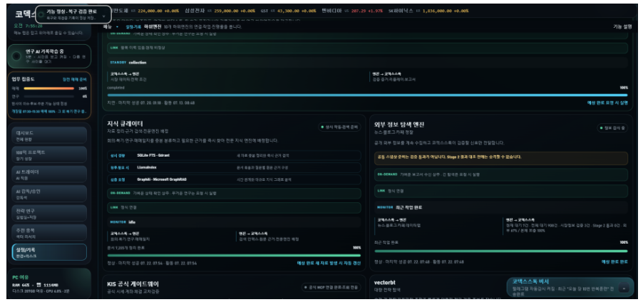
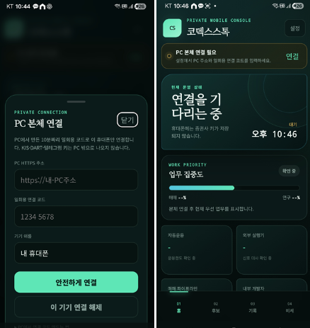
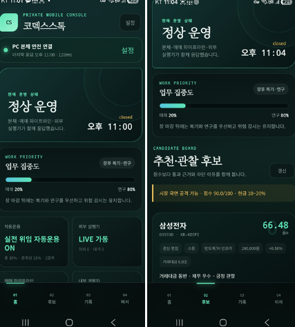

# 2026-07-22 Verified Upgrade

이번 업데이트는 오전의 지식 큐레이터 구축과 저녁의 안드로이드 모바일 콘솔 연결을 공개 가능한 코드와 실제 화면으로 기록합니다.

## 오전: 지식 큐레이터

코덱스스톡의 회의, 연구, 장후 복기, 후보 판단, 외부 신호가 누적될수록 필요한 근거를 다시 찾기 어려워지는 문제를 해결했습니다.

구현된 핵심은 다음과 같습니다.

- 원본 원장을 수정하지 않는 읽기 전용 검색 투영
- 핵심 원장과 장기 아카이브의 분리
- 민감 테이블·열 제외와 값 정리
- 원본 위치, 발생시각, 원본 해시, 투영 해시 보존
- JSONL 증분 색인과 내용 해시 기반 변경 판별
- SQLite FTS5/BM25 즉시 검색
- Qdrant 경량 유사 검색
- LlamaIndex 문서 분할 인덱스
- Graphiti·GraphRAG 요청형 실험 경로
- 장중 경량 모드와 장후·휴장일 무거운 작업 분리

검증 시점의 실제 상태는 7,871개 문서, 23개 상시 소스, 161개 아카이브 후보였고 스케줄러 스레드가 정상 동작했습니다. Qdrant와 LlamaIndex는 완료, Graphiti와 GraphRAG는 부분 실험으로 판정했습니다.

## 저녁: 안드로이드 앱 연결 성공

코덱스스톡 PC 본체를 개인 안드로이드 기기에서 볼 수 있는 전용 모바일 콘솔을 구현했습니다.

- 일회용 8자리 연결 코드
- 만료·시도 횟수 제한·재사용 차단
- 원문을 저장하지 않는 해시 기반 기기 토큰
- 기기별 연결 폐기
- 개인 HTTPS 사설망 연결
- 운영 상태, 업무 집중도, 후보, 직원, 하위엔진, 내부개발자 사건 조회
- 읽기 전용 비서
- 위험을 줄이는 긴급정지 확인 경로
- 매수·매도·자동운용 시작·위험 한도 완화 차단

## 검증

개발 작업공간과 공개 스냅샷에서 다음 검증을 통과했습니다.

- Python 전체 회귀 테스트 1,191개 통과
- 지식 큐레이터 전용 회귀 테스트 통과
- 모바일 접근·명령 경계 테스트 통과
- Android unit test와 lint 통과
- 영문 경로의 공개 소스 재현 검사에서도 Android 단위 테스트 1개가 실패 없이 통과했고, lint 오류는 0건이었습니다. Capacitor 기본 리소스와 버전 안내에 대한 경고 16건은 별도 보고서에 남겼습니다.
- `npm audit` 취약점 0건
- 실제 안드로이드 기기 페어링과 토큰 폐기 확인
- 390x844 모바일 화면의 가로 넘침·버튼 잘림 없음
- 디버그 APK v2 서명 확인
- 공개 스냅샷 Python 전체 회귀 테스트 1,192개 통과, 2개 건너뜀

건너뛴 2개 검사는 공개 저장소에 의도적으로 포함하지 않은 개인 PC 외부엔진 런타임 계약이 있어야 실행되는 항목입니다. 지식 큐레이터와 모바일 기능 테스트는 건너뛰지 않았습니다.

공개본 자체에서 Python compile, 데스크톱·모바일 JavaScript syntax, 비밀값 패턴 검사도 다시 통과했습니다.

## 안전 경계

이번 공개본에는 다음을 포함하지 않습니다.

- 실제 KIS·DART·Telegram·OpenAI 키
- 계좌번호, 잔고, 주문, 체결, 손익 원장
- 실제 모바일 연결주소와 기기 토큰
- Tailscale tailnet 식별값
- 개인 회의·복기·매매일지 원문
- 생성된 APK와 서명키

지식 큐레이터는 주문 경로를 수정하지 않으며, 모바일 콘솔도 직접 매수·매도나 위험 한도 완화를 수행하지 않습니다.

## 구현 위치

- [`app/knowledge_curator.py`](../app/knowledge_curator.py)
- [`app/knowledge_engine_worker.py`](../app/knowledge_engine_worker.py)
- [`tests/test_knowledge_curator.py`](../tests/test_knowledge_curator.py)
- [`app/mobile_console.py`](../app/mobile_console.py)
- [`app/mobile_pairing_cli.py`](../app/mobile_pairing_cli.py)
- [`app/web/mobile/`](../app/web/mobile/)
- [`mobile/codexstock-android/`](../mobile/codexstock-android/)
- [`tests/test_mobile_console.py`](../tests/test_mobile_console.py)
