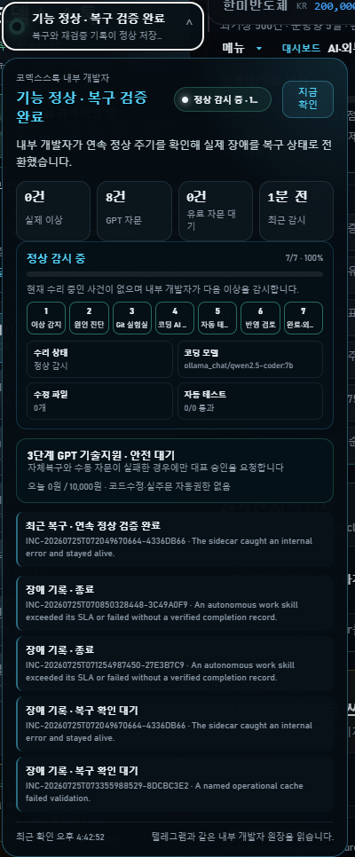

# CodexStock Upgrade Evidence - 2026-07-25

This note describes the latest reviewable CodexStock architecture without
publishing credentials, account records, broker tokens, private journals, or
live-order data. It records implemented behavior and test evidence, not an
investment-performance claim.

## 1. Evidence-aware operations

CodexStock now separates five different meanings that were previously easy to
confuse: code exists, a component is connected, a recent call succeeded, an
end-to-end workflow succeeded, and the function is currently eligible for
operation. Staff and engine cards can include heartbeat, evidence age, last
success, decision eligibility, progress, and next action.

System health and trading-pipeline health are separate. A running web server no
longer proves that candidate discovery, validation, signal publication, executor
handoff, and result reconciliation are all working.

## 2. Knowledge curator

The knowledge layer organizes research notes, market reviews, employee lessons,
external research, and failure evidence so staff can retrieve relevant material
instead of scanning every historical document.

- document indexing and retrieval orchestration
- vector retrieval with BGE-M3-compatible embeddings
- optional graph projections for entity and relationship exploration
- source, timestamp, freshness, evidence grade, and provenance metadata
- duplicate suppression and immutable-original handling
- retrieval evidence that can be attached to later decisions and reviews

Document and vector retrieval are the primary operational path. Graph projections
remain an evolving research layer and are not represented as complete knowledge.

## 3. Role-based model orchestration

The system does not depend on one language model for every task.

- general research and review: locally configured language model
- coding repair candidate: Qwen2.5-Coder through Aider
- retrieval: BGE-M3-compatible embedding path
- order execution: deterministic rules, not a generative model
- difficult technical escalation: bounded GPT advice or separately approved support

This is orchestration rather than model merging. Deterministic safety checks keep
creative model output away from direct order submission.

## 4. Internal developer and isolated repair laboratory

The internal developer observes process health, APIs, data freshness, work-skill
completion, external engines, and selected business-pipeline evidence. Safe local
recovery is attempted before code repair.

The visible seven-stage workflow is:

1. detect an abnormal condition
2. diagnose the root cause
3. create an isolated Git repair workspace
4. run a bounded coding model through Aider
5. execute approved tests and protected-file checks
6. review and stage a safe candidate result
7. close only after revalidation evidence exists

Production credentials, account data, live-order execution, risk-limit relaxation,
security disabling, and unreviewed deployment remain outside this repair path.

## 5. Repair-storm prevention

A recent incident exposed an important orchestration defect: a short skill inside a
shared long-running work cycle was judged by its individual SLA instead of the
shared cycle budget. This produced repeated false `WORK_SKILL_STALLED` incidents and
multiple isolated Aider processes, which increased system load and caused transient
UI reconnects.

The repair changed the contract as follows:

- a skill selected inside one daemon cycle inherits the maximum shared-cycle SLA
- a non-terminal timing warning cannot launch a coding repair
- only terminal failure evidence can enter the local code-repair queue
- accumulated orphaned repair processes were removed without stopping the main app
  or deterministic execution sidecar
- the scheduled internal-developer path was executed after the fix
- the full automated suite passed: `1,303` tests

This is an operations-stability result, not evidence of investment profitability.

## 6. Trading pipeline and external execution sidecar

The architecture separates candidate research from deterministic execution:

`scan -> validate -> risk review -> ticket -> signed signal -> sidecar -> result ledger`

The sidecar independently checks mode, expiry, duplication, account availability,
exposure, price bounds, and emergency-stop state. Semi-automatic and delegated
automatic modes use separate approval contracts. Public MCP surfaces remain
read-only and do not submit live orders.

## 7. Independent audit roles

Three operational observers complement the internal developer:

- technical audit checks runtime, API, storage, resource, and regression evidence
- sub-engine audit checks adapter availability, round-trip evidence, and freshness
- trading-pipeline audit checks whether work reaches the next required stage

The developer proposes or performs bounded recovery. Auditors independently assess
whether the result is actually healthy.

## 8. Research Forge and external engines

Research Forge provides reproducible research jobs, historical replay, strategy
comparison, dataset lineage, report bundles, microstructure archives, and optional
heavy-engine adapters. Heavy research is scheduled outside market-focused windows
so it does not compete with quotes, risk checks, execution, or reconciliation.

External projects retain their own licenses and are not relicensed by CodexStock.

## 9. Mobile private operations console

The Android console provides paired-device access to PC connectivity, system health,
current work focus, candidate summaries, internal-developer state, recovery history,
and emergency stop. It does not store broker credentials or provide unrestricted
order controls.

## 10. Current engineering priorities

The project is intentionally not described as a proven commercial trading system.
The next engineering priorities are reduced monolithic coupling, unified state and
freshness contracts, complete repair review closure, measurable knowledge
contribution, and long-running operational evidence.

## Review boundary

This repository is evaluation-only. The screenshot contains operational status
only; private account, order, credential, and personal journal data are excluded.
See the root `LICENSE` for the applicable restrictions.
